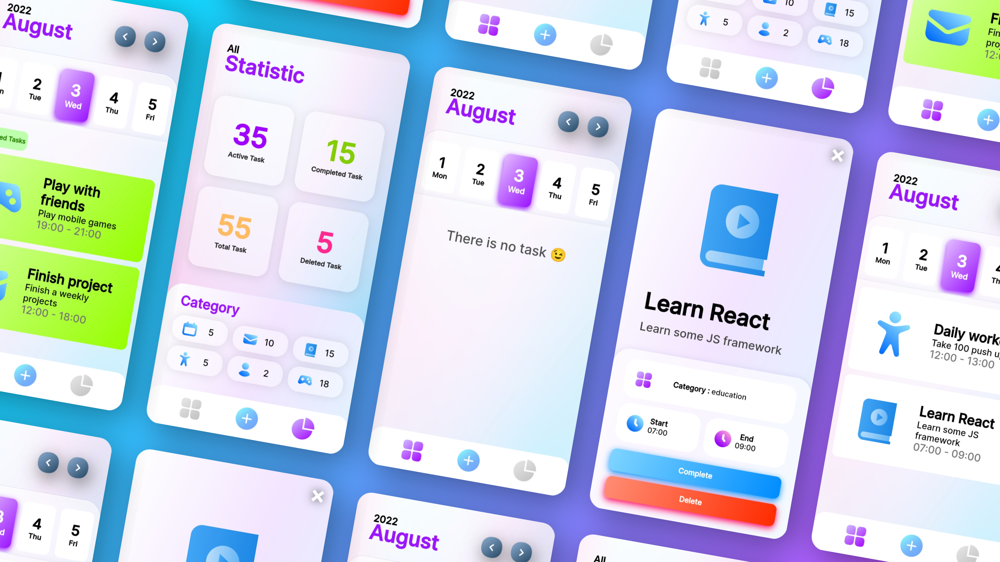

### Task Manager HTML CSS JavaScript

This is a fully functional web based task manager app.
#### Warning!!
>Not recommended using other browser. Use chrome instead.
 The code might not responsive for bigger screen size

Changelogs---
HTML
Remove the images from next/prev month button.

JS
improvised the logic for next/prev month buttons.
removed onclicks with addEventListeners.
removed the creating month days logic from timeinit function and created it's own function.

CSS
replaced width/height and some other properties unit from px to rem.
removed width on nav bar and added left,right properties.
replace dateBtnActive class with dateBtn.active and remove repeating code.

Currently Working on---
Cleaning code
Responsiveness
